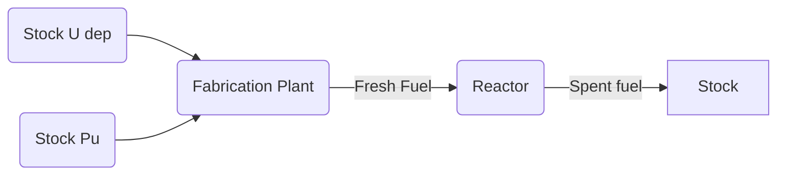

# FITProject

The repository contains work related to FIT (Functionnality Isolation Test) project.

## Introduction

Since the 90’s, a lot of different fuel cycle tools have been developed by several institutions (industrial, engineering, academic, etc.). Several level of complexity could be reached, from the simple spread sheet to the complex simulation framework. Also, all the tools can reach different level of capabilities and flexibility and could be adapted for one specific problem to any problems related to the fuel cycle.

Dynamic fuel cycle simulators are used for several applications. they are part of the technical evaluation of innovative systems deployment. Also, they help to identify drivers / parameters interactions in fuel cycle fleet physics. Finally, this kind of tools produces data for further assessments (economy, safety, non-proliferation, etc.). For thoses reasons, fuel cycle simulators can be viewed as decision support helping tool.

The FIT project aims to **improve the confidence in fuel cycle simulators output**. For this purpose, several technics are available : 
- Uncertainty assessement and propagation
- Comparison with experimental data
- Code testing or comparison

FIT project is related to this last item. The purpose of the FIT Benchmarks is to **test the impact of FCC functionality** and how this **impact is propagated** in the fuel cycle calculation.

## Abbreviations and definitions

RPC : Reactor Physics Code

FCC : Fuel Cycle Code

FLM : Fuel Loading Model

A FLM aims to adapt the fresh fuel composition according to the reactor requirements. For instance, the fissile fraction is calculated from the fissile stock quality in order to reach the required burnup of the reactor. FLM could be based on neural network, Plutonium equivalent, etc. This relation is usually built from physics constraint and upstream reactor calculation. It is possible to increase the complexity of the FLM according to the level of physics constraints. Here, FLM means there is a process that connect the fresh fuel composition to the available materials, whatever the complexity is.

Recipe : 

The fresh fuel composition in the reactor at Beginning Of Cycle (BOC) is always the same. For instance, the reactor load a MOX fuel with 7% (mass) of plutonium with always the same isotopic composition. It is possible to use recipe interpolation, closest composition, etc.  

## List of features to be tested

## FIT project roadmap

For each tested features, the FIT benchmark is based on a set of RPC and FCC calculations. The roadmap is presented from the first tested feature : 
    
    Update the fuel composition vs. Fixed Fraction

1. Reference calculation from RPC run 

The participant/institution (e.g., Hawaii National Laboratory) needs a reference model of the reactor (e.g., 1000 MWt metallic fuel SFR with 1.2 breeding ratio) and its fuel compositions (loaded and discharged) during the equilibrium cycle. This should be generated by an RPC (e.g., ERANOS). Let’s say the Pu content of this reference loaded fuel composition is 10 wt% and the discharged Pu content is 12 wt% (this is a breeder reactor; these are mass-weighted values across driver fuel and blankets). These are the reference values for the equilibrium SFR core using the equilibrium SFR Pu vectors in the recycled fresh fuel.

For this part, each participant/institution have to precisely describe criteria that drives the reactor calculation. For instance, it could be reactivity based for a PWR or a targeted breeding ratio for a SFR modelization. **The reference calculation is freely designed** by each participant/institution so that it can be run easily.

2. Reference calculation from FCC run

For the FCC (e.g., ORION) calculation of this reference model, this data should be easy inputs to the code. This is what we should be calling the “recipe approach”. There is no need to turn on any functionality that updates the fuel composition because the charge and discharge compositions are already provided as recipes.

For this part, each participant/institution have then to ensure that **the FCC calculation exactly fits the RPC calculation**. 

After this step, we consider that the FCC is tuned to produce the same result whatever the feature is.

3. Process tested compositions from FCC and RPC run

Now we switch the fresh fuel composition to be built from the tested isotopic vector which are specified in the specifications, so that all participants use the same Pu vector(s) in the perturbed calculations. Then, Hawaii National Laboratory needs to produce the new loaded and discharged Pu contents using the same RPC (ERANOS) and the functionality within their FCC (e.g., ORION) that they are using (e.g., Pu equivalence model with weight factors, neural network, etc.) to produce the following figure:

!!! PUT A FIGURE !!!

4. Deviation impact on a 100 years time range FCC calculation

Finally, a FCC long term calculation (up to 100 years) is done in order to have a connexion between results and « real scientific question ».   

## The github repository

You can download the github repository from the following command : 

    git clone https://github.com/FuelCycleFIT/FITProject.git
    cd FITProject

From that point you can fork the repository from github web site and define upstream and origin remotes. 

    git remote set-url origin https://github.com/[YourAccount]/FITProject.git
    git remote add upstream https://github.com/FuelCycleFIT/FITProject.git

If your repo is properly defined, you should have folowing remotes :

    git remote -v
    origin  https://github.com/[YourAccount]/FITProject.git (fetch)
    origin  https://github.com/[YourAccount]/FITProject.git (fetch)
    upstream    https://github.com/FuelCycleFIT/FITProject.git (fetch)
    upstream    https://github.com/FuelCycleFIT/FITProject.git (push)

From this point, you should be able to push modifications on your fork and to request merge on the upstream repository.

## Codes

### RPC

Each institution describes RPC that they use with main publications.

### FCC

Each institution describes FCC that they use with main publications.

## List of features to test

In this part, we list all the features we want to test and we write an associated description.

## Exercices Nomenclature and small description

Nomenclature has three informations : 

- The tested feature number Feat_I
- The exercise number Ex_J
- The case number Case_K

Example : Feat1_Ex1_Case1

This will define the tree in the FIT repository.

Feat_1

The scheme of the scenario is as following :

Ex1

The first exercice is related to a PWR loaded with MOX fuel.

Ex2

The first exercice is related to a SFR loaded with MOX fuel.
